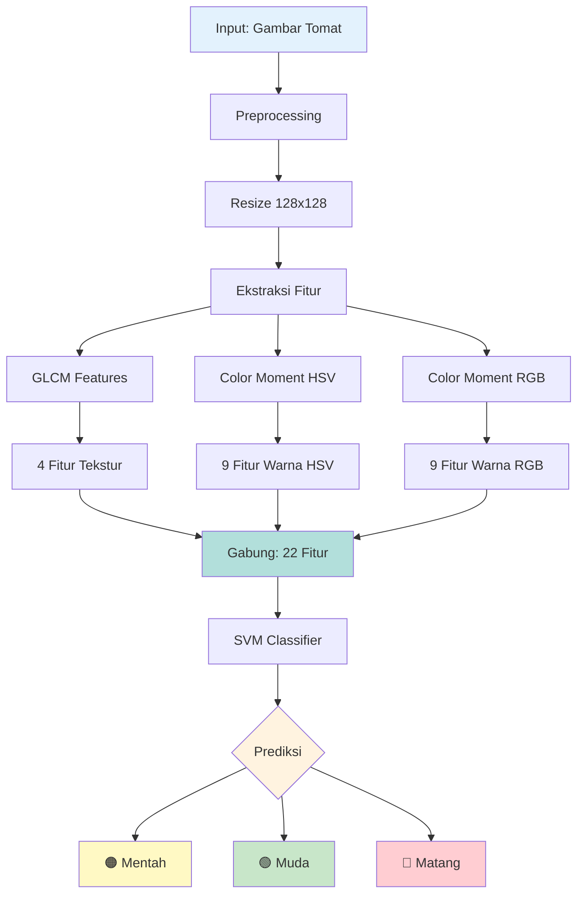

# 🍅 Sistem Klasifikasi Kematangan Buah Tomat

## 📋 Deskripsi Proyek

Aplikasi berbasis **Computer Vision** dan **Machine Learning** untuk mengklasifikasikan tingkat kematangan buah tomat secara otomatis menggunakan analisis citra digital.

Sistem ini menggunakan kombinasi **22 fitur** yang terdiri dari:

- **GLCM (Gray Level Co-occurrence Matrix)** untuk ekstraksi fitur tekstur (4 fitur)
- **Dual Color Moment (HSV + RGB)** untuk ekstraksi fitur warna (18 fitur)
- **Support Vector Machine (SVM)** untuk klasifikasi

### 💡 Kenapa Dual Color Space (HSV + RGB)?

#### 1. **Informasi Lebih Lengkap**

- **HSV unggul untuk:** Representasi warna (Hue) dan intensitas (Saturation, Value)
- **RGB unggul untuk:** Nilai warna absolut (terutama channel Red untuk tomat matang)
- **Gabungan:** Model dapat "melihat" dari 2 perspektif berbeda → lebih robust!

#### 2. **Contoh Kasus Real**

**Tomat Matang:**

- 🔴 HSV melihat: Hue rendah (0-20) = merah
- 🔴 RGB melihat: Red channel tinggi (200-255) = merah terang
- 🎯 Model: "Hue rendah DAN Red tinggi → pasti Matang!" ✅

**Tomat Mentah:**

- 🟢 HSV melihat: Hue tinggi (60-80) = hijau
- 🟢 RGB melihat: Green channel tinggi = hijau
- 🎯 Model: "Hue tinggi DAN Green tinggi → pasti Mentah!" ✅

#### 3. **Redundancy = Robustness**

- ✅ Jika HSV kurang jelas karena lighting → RGB membantu!
- ✅ Jika RGB terpengaruh shadow → HSV tetap reliable!
- ✅ Kombinasi keduanya meningkatkan akurasi dan konsistensi

### 🎯 Tujuan

- Mengotomatisasi proses klasifikasi kematangan tomat
- Meningkatkan akurasi dan konsistensi dalam sortir buah
- Membantu petani dan distributor dalam quality control

### 🏆 Kategori Klasifikasi

1. **🟠 Mentah** - Tomat yang belum matang (warna hijau kekuningan)
2. **🟢 Muda** - Tomat setengah matang (warna hijau)
3. **🔴 Matang** - Tomat matang sempurna (warna merah)

---

## 🧠 Algoritma dan Metodologi

### 1. **Ekstraksi Fitur GLCM (Gray Level Co-occurrence Matrix)**

GLCM adalah metode analisis tekstur yang menghitung frekuensi kemunculan pasangan pixel dengan intensitas tertentu.

**Langkah-langkah GLCM:**

```
1. Konversi gambar ke Grayscale
   ↓
2. Buat matriks co-occurrence (256×256)
   - Hitung pasangan pixel horizontal (0°)
   - Pixel[i,j] dan Pixel[i,j+1]
   ↓
3. Normalisasi matriks
   - Ubah frekuensi → probabilitas
   ↓
4. Hitung 4 fitur statistik:
   • Contrast: Perbedaan intensitas lokal
   • Dissimilarity: Variasi intensitas
   • Homogeneity: Keseragaman tekstur
   • Energy: Uniformitas distribusi
```

**Rumus Fitur GLCM:**

- **Contrast**: `Σ Σ P(i,j) × (i-j)²`
- **Dissimilarity**: `Σ Σ P(i,j) × |i-j|`
- **Homogeneity**: `Σ Σ P(i,j) / (1 + (i-j)²)`
- **Energy**: `Σ Σ P(i,j)²`

### 2. **Ekstraksi Fitur Color Moment (Dual Color Space)**

Color Moment merepresentasikan distribusi warna menggunakan 3 momen statistik untuk setiap channel warna.

**Sistem ini menggunakan KEDUA color space (HSV + RGB) secara bersamaan!**

#### **Keunggulan Dual Color Space:**

| Aspek              | HSV                             | RGB                         | Gabungan                 |
| ------------------ | ------------------------------- | --------------------------- | ------------------------ |
| **Warna Murni**    | Hue = warna murni (hijau→merah) | Tercampur dengan brightness | Lebih robust             |
| **Intensitas**     | Saturation = kejenuhan warna    | Tidak ada pemisahan         | Dapat info dari 2 sisi   |
| **Kecerahan**      | Value = kecerahan terpisah      | Tercampur dengan warna      | Lebih invariant          |
| **Lighting**       | ✅ Invariant terhadap lighting  | ❌ Terpengaruh pencahayaan  | ✅✅ Sangat robust       |
| **Absolute Value** | ❌ Tidak ada nilai absolut      | ✅ Nilai warna absolut      | ✅✅ Best of both worlds |

**3 Momen Statistik per Channel:**

1. **Mean (μ)**: Rata-rata nilai warna

   ```
   μ = (1/N) Σ pixel_value
   ```

   - Hue rendah = Merah (matang)
   - Hue tinggi = Hijau (muda)

2. **Standard Deviation (σ)**: Variasi warna

   ```
   σ = √[(1/N) Σ (pixel_value - μ)²]
   ```

   - Tinggi = Warna bervariasi
   - Rendah = Warna seragam

3. **Skewness**: Kemencengan distribusi
   ```
   Skewness = (1/N) Σ [(pixel_value - μ) / σ]³
   ```
   - Positif = Condong kanan
   - Negatif = Condong kiri

**Total Fitur Color Moment**: 18 fitur

- HSV: 9 fitur (3 momen × 3 channel)
- RGB: 9 fitur (3 momen × 3 channel)

### 3. **Klasifikasi dengan SVM (Support Vector Machine)**

SVM mencari **hyperplane** (bidang pemisah) optimal yang memisahkan kelas-kelas data dengan margin maksimal.

**Parameter SVM yang Digunakan:**

- **Kernel**: RBF (Radial Basis Function)

  ```
  K(x, x') = exp(-γ ||x - x'||²)
  ```

  - Cocok untuk data non-linear
  - Dapat menangani pola kompleks

- **C = 1.0**: Parameter regularisasi

  - Trade-off antara margin dan error
  - Mengontrol overfitting

- **Gamma = 'scale'**: Parameter kernel
  ```
  gamma = 1 / (n_features × X.var())
  ```
  - Menentukan jangkauan pengaruh satu data

**Proses Training:**

```
Dataset (100%)
    ↓
Split Data
    ├─→ Training (75%) → Fit SVM Model
    └─→ Testing (25%) → Evaluasi Akurasi
                ↓
        Confusion Matrix
        Classification Report
```

---

## 📊 Arsitektur Sistem



---

## 🚀 Instalasi dan Penggunaan

### Persyaratan Sistem

- Python 3.8 atau lebih tinggi
- Windows/Linux/MacOS

### Langkah Instalasi

1. **Clone atau Download Project**

   ```bash
   cd project-akhir
   ```

2. **Install Dependencies**

   ```bash
   pip install -r requirements.txt
   ```

   **Library yang Dibutuhkan:**

   - `opencv-python` - Pengolahan citra
   - `numpy` - Komputasi numerik
   - `scikit-learn` - Machine learning (SVM)
   - `Pillow` - Manipulasi gambar
   - `matplotlib` - Visualisasi
   - `seaborn` - Visualisasi statistik

3. **Struktur Folder Dataset**

   ```
   dataset/
   ├── mentah/     # Gambar tomat mentah
   ├── muda/       # Gambar tomat muda
   └── matang/     # Gambar tomat matang
   ```

4. **Jalankan Aplikasi**
   ```bash
   python main.py
   ```

### 📖 Cara Penggunaan

#### **Mode 1: Auto-Training (Recommended)**

Program akan otomatis melatih model saat startup jika folder `dataset` tersedia.

1. Jalankan `python main.py`
2. Tunggu proses training selesai
3. ✨ **Model otomatis tersimpan** ke folder `models/` dengan timestamp
4. 📊 **Akurasi ditampilkan** di badge header dengan color-coding
5. Klik **"🖼️ Pilih Gambar Tomat"**
6. Klik **"🔍 Proses Klasifikasi"**
7. 🎯 Lihat **Confidence Score** di hasil klasifikasi

#### **Mode 2: Manual Training**

1. Klik **"📚 Load Dataset & Training"**
2. Pilih folder dataset
3. Tunggu training selesai (HSV + RGB + GLCM otomatis digunakan)
4. 📊 **Akurasi badge** di header akan update otomatis
5. ✅ **Model auto-saved** dengan timestamp ke `models/tomato_model_COMBINED_[TIMESTAMP].pkl`
6. Lihat hasil akurasi dan confusion matrix

#### **Mode 3: Load Model Tersimpan**

1. Klik **"📂 Load Model"**
2. Pilih file model (.pkl)
3. Langsung gunakan untuk klasifikasi

---

## 🎨 Fitur Aplikasi

### 1. **🎨 UI Modern & Premium**

- ✨ **Dark Theme** - Desain modern dengan skema warna gelap yang elegan
- 🏆 **Accuracy Badge** - Display akurasi prominently di header dengan color-coding:
  - 🟢 **Hijau** (≥85%): Akurasi sangat baik
  - 🟡 **Kuning** (<85%): Akurasi perlu improvement
- 🎯 **Gradient Backgrounds** - Background dengan gradient untuk tampilan premium
- 💎 **Raised Buttons** - Tombol dengan shadow effect dan hover states

### 2. **Panel Kontrol**

- ✅ Pilihan metode ekstraksi (HSV/RGB)
- ✅ Training otomatis dan manual
- ✅ **Auto-Save Model** - Model otomatis tersimpan setelah training
- ✅ Save/Load model dengan default path ke folder `models/`
- ✅ Reset aplikasi

### 3. **Visualisasi Hasil**

- 📊 Confusion Matrix (heatmap)
- 📈 Histogram RGB dan HSV
- 🖼️ Preview gambar input
- 📋 Classification report lengkap
- 🎯 **Confidence Score** - Persentase kepercayaan prediksi (baru!)

### 4. **Analisis Mendalam**

Setelah klasifikasi, sistem menampilkan:

- Citra RGB, HSV, dan Grayscale
- Histogram distribusi warna
- Interpretasi hasil berdasarkan nilai mean Hue/RGB

**Contoh Output Klasifikasi:**

```
=== HASIL KLASIFIKASI ===

Gambar: tomat_test.jpg
Metode: HSV + GLCM

HASIL PREDIKSI: Matang
CONFIDENCE: 94.23%

🔴 MATANG: Red channel tinggi (185.3),
           Hue rendah (12.5) → warna merah dominan

🟢 MUDA: Green channel tinggi (142.7),
         Hue tinggi (78.2) → warna hijau dominan

🟠 MENTAH: Red-Green seimbang (R:125.4, G:118.9),
           Saturation sedang (95.3)
```

---

## 📈 Evaluasi Model

### Metrik Evaluasi

1. **Accuracy**: Persentase prediksi benar

   ```
   Accuracy = (TP + TN) / Total Data
   ```

2. **Confusion Matrix**: Tabel prediksi vs aktual

   ```
              Predicted
              M  Mu Ma
   Actual  M  [TP FP FP]
           Mu [FN TP FP]
           Ma [FN FN TP]
   ```

3. **Classification Report**:
   - **Precision**: Ketepatan prediksi positif
   - **Recall**: Kemampuan mendeteksi kelas
   - **F1-Score**: Harmonic mean precision & recall

---

### Perbandingan Metode Ekstraksi Fitur

| Metode                 | Total Fitur | Akurasi (Est.) | Kelebihan                                                             | Use Case                  |
| ---------------------- | ----------- | -------------- | --------------------------------------------------------------------- | ------------------------- |
| **HSV + RGB + GLCM** โ | 22          | ~85-95%        | โ Best robustness<br>โ Dual color perspective<br>โ Lighting invariant | **Rekomendasi (Current)** |
| **HSV + GLCM**         | 13          | ~80-90%        | โ Robust pencahayaan<br>โ Deteksi warna baik                          | Small dataset             |
| **RGB + GLCM**         | 13          | ~70-80%        | โ Simple & fast<br>โ Absolute color                                   | Controlled lighting       |

### Rekomendasi

๐ **HSV + RGB + GLCM (COMBINED)** adalah metode terbaik karena:

1. **Dual Color Space Advantage:**

   - Kombinasi HSV (lighting-invariant) + RGB (absolute values)
   - 22 fitur memberikan informasi lebih lengkap

2. **Higher Accuracy:**

   - Lebih banyak fitur = lebih banyak informasi
   - Model lebih robust terhadap variasi kondisi

3. **Future-Proof:**
   - Scalable untuk dataset lebih besar
   - Compatible dengan advanced classifiers

---

## 📁 Struktur File

```
project-akhir/
│
├── main.py                 # File utama aplikasi (Enhanced!)
├── requirements.txt        # Dependencies Python
├── installation.txt        # Panduan instalasi singkat
├── README.md              # Dokumentasi lengkap (file ini)
├── LAPORAN.md             # Laporan teknis
│
├── dataset/               # Dataset training
│   ├── mentah/            # Tomat mentah (hijau kekuningan)
│   ├── muda/              # Tomat setengah matang (hijau)
│   └── matang/            # Tomat matang (merah)
│
├── test_images/           # Gambar untuk testing
│
└── models/                # Model tersimpan (.pkl)
    └── tomato_model_HSV_[timestamp].pkl  # Auto-saved models
```

---

## 🎓 Pengembang

**Luthfi Shidqi H**  
Mata Kuliah: Pengolahan Citra Digital  
Semester 5

---

## 📚 Referensi

1. Haralick, R. M., et al. (1973). "Textural Features for Image Classification"
2. Stricker, M. A., & Orengo, M. (1995). "Similarity of color images"
3. Cortes, C., & Vapnik, V. (1995). "Support-vector networks"
4. OpenCV Documentation: https://docs.opencv.org/
5. Scikit-learn Documentation: https://scikit-learn.org/

---

## 📄 Lisensi

Project ini dibuat untuk keperluan akademik dan pembelajaran.

---

## 🤝 Kontribusi

Untuk pertanyaan atau saran perbaikan, silakan hubungi pengembang.

---

**Terakhir diupdate**: Januari 2026
